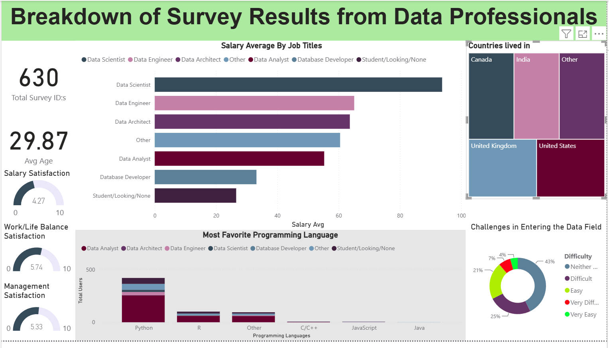

# Data Professionals Survey – Power BI Dashboard

A Power BI dashboard built on real survey responses from data professionals.

## Dashboard

## What I did
- Cleaned the survey data in Power BI: kept the relevant columns and turned free-text answers into usable categories
- Used DAX to calculate measures such as average salary
- Built visuals for average salary by job title, most used programming languages, work-life balance and a regional breakdown
- Designed the layout so the main findings can be read at a glance

## Files
- `PowerBI+ExcelData Link` – link to the Power BI and Excel files

## Tools
Power BI, DAX, Excel
